# Use Cases

Complete use case documentation with Mermaid diagrams.

## User Authentication Flow

User connects wallet and authenticates with the platform.

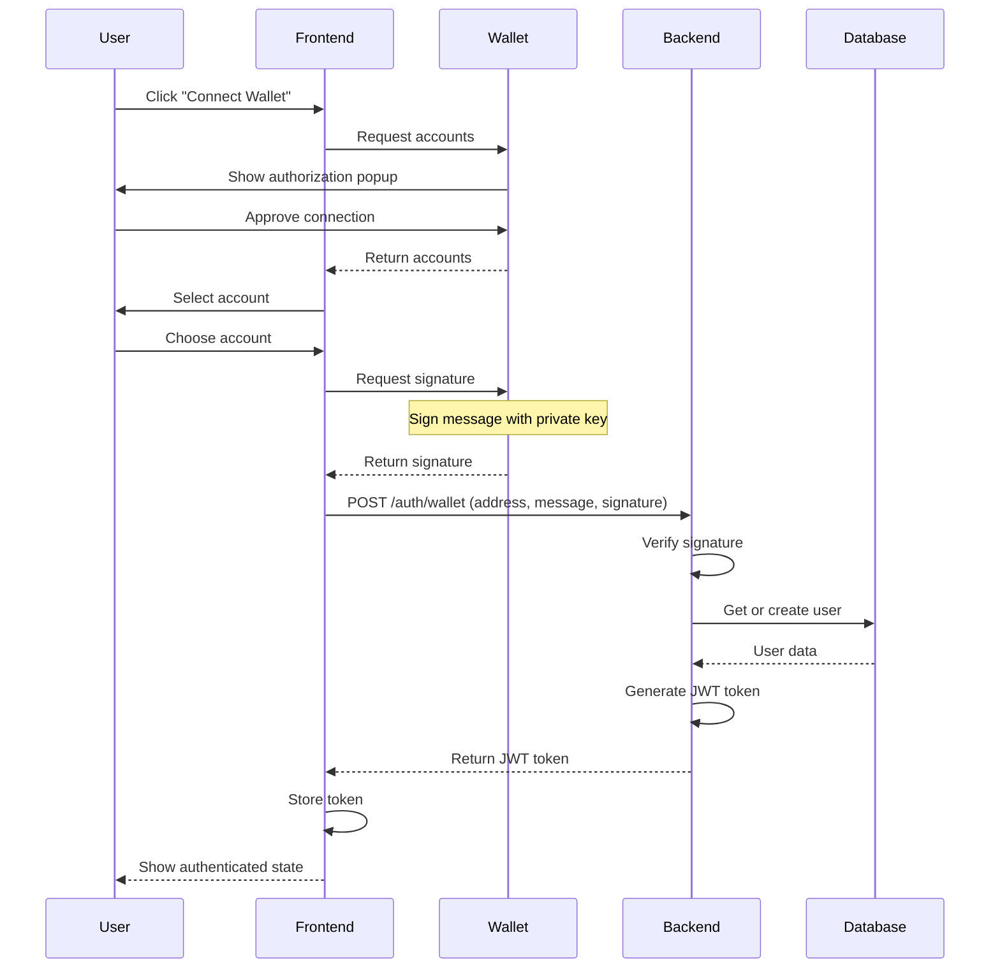

## Sell Order Flow (DOT → PIX)

User sells DOT and receives PIX payment.

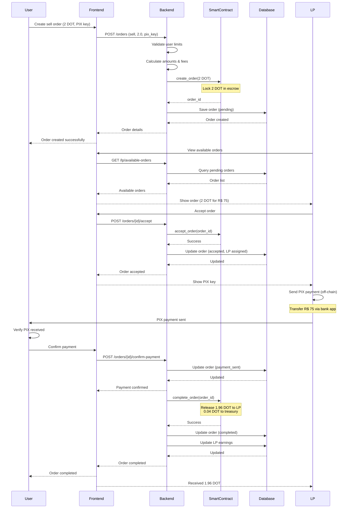

## Buy Order Flow (PIX → DOT)

User buys DOT by paying with PIX.

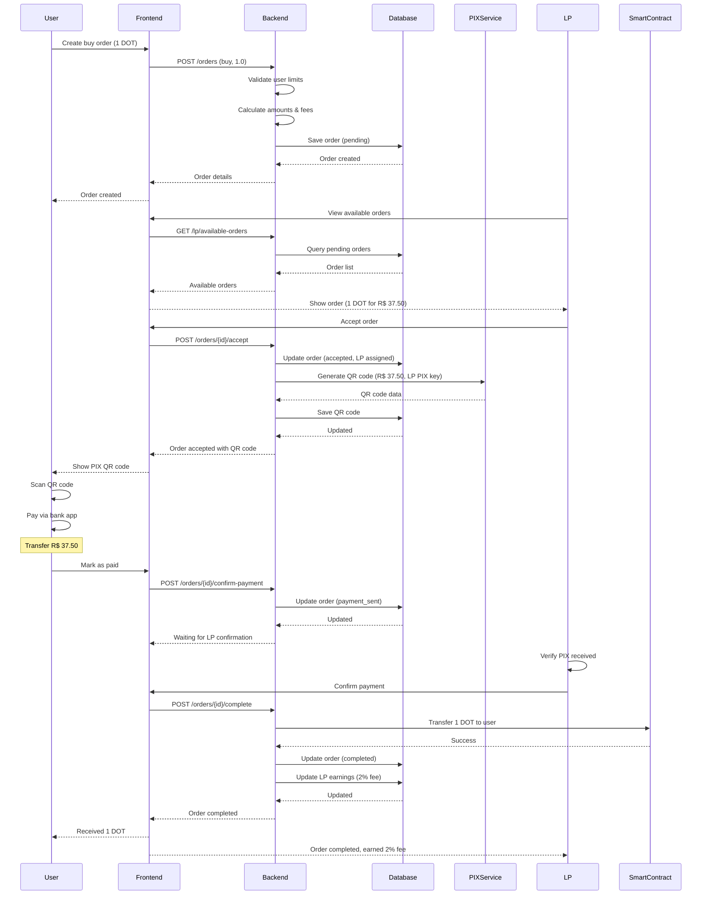

## Order State Machine

Order lifecycle and state transitions.

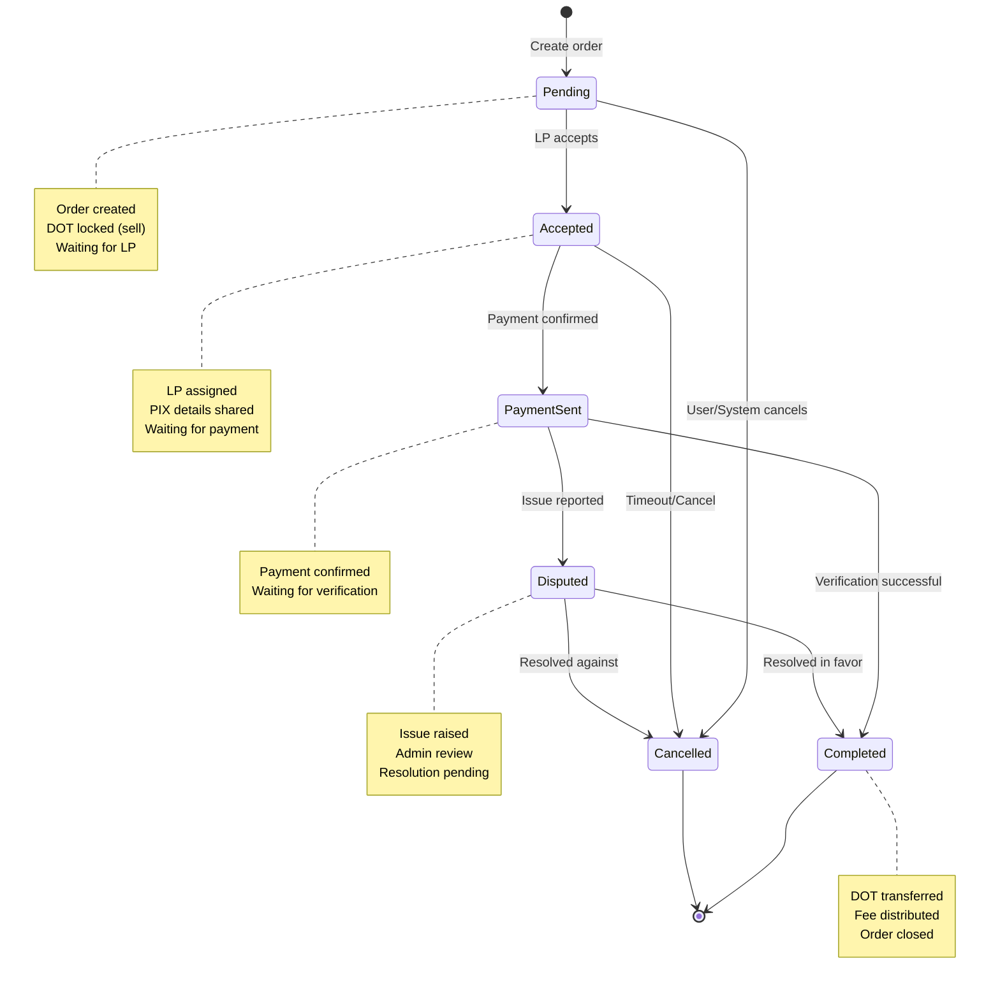

## System Architecture Diagram

High-level system components and interactions.

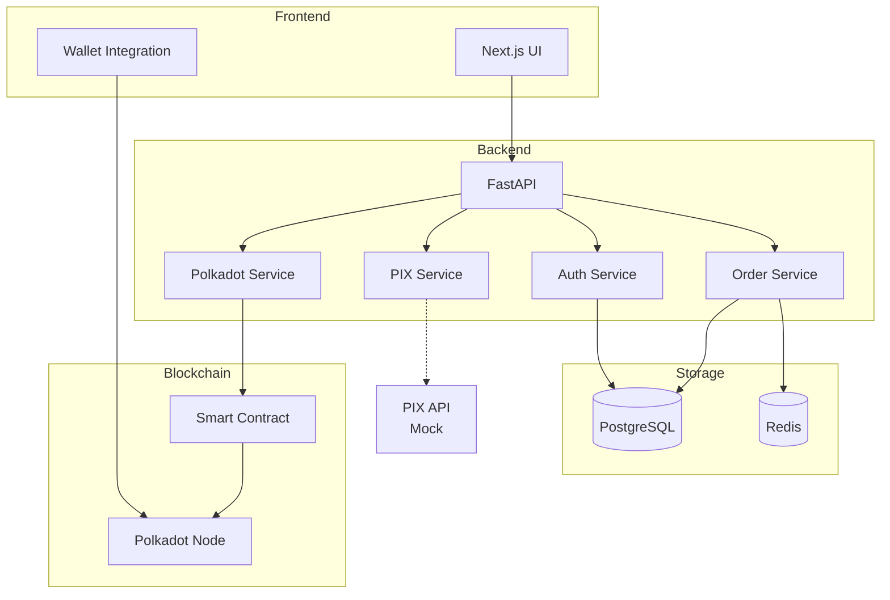

## Data Model

Entity relationship diagram.

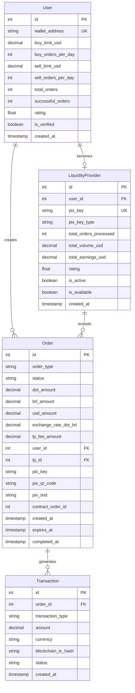

## LP Registration Flow

Liquidity Provider registration process.

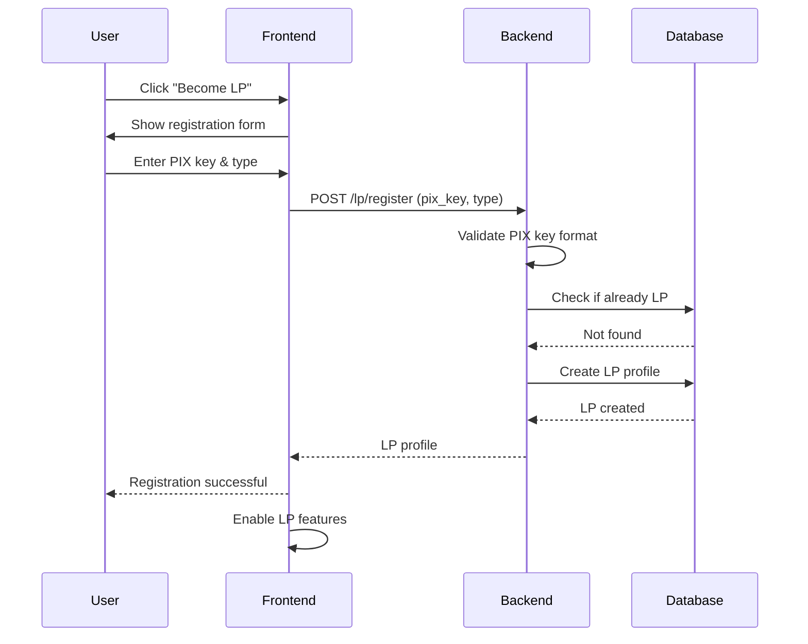

## Order Cancellation Flow

Cancel order before completion.

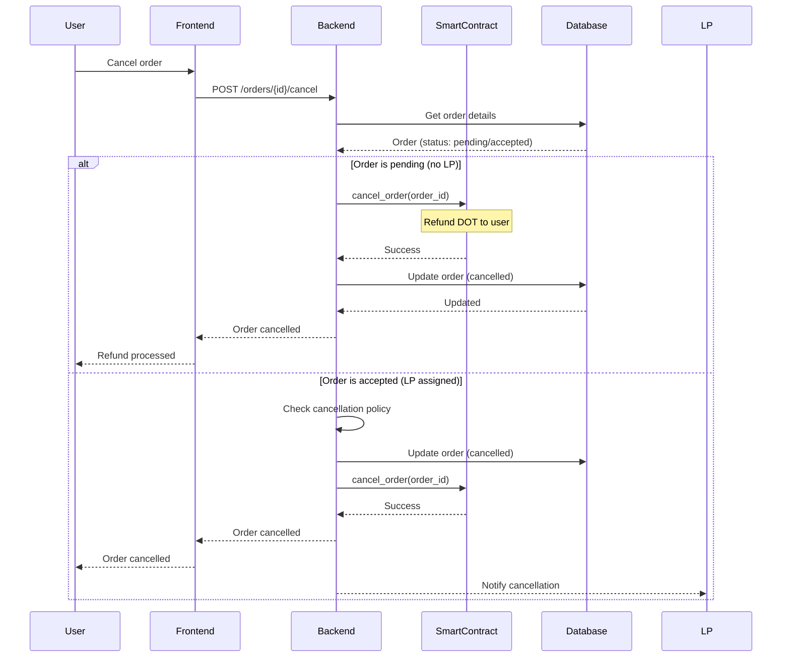

## Exchange Rate Update Flow

Fetch and update DOT exchange rates.

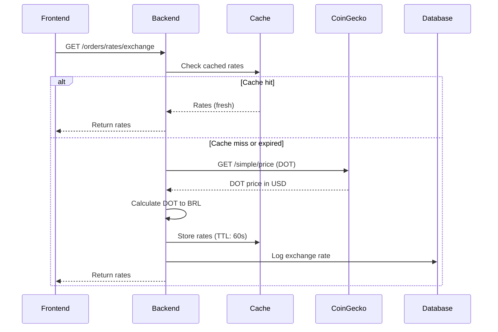

## Limit System Flow

User limit validation and updates.

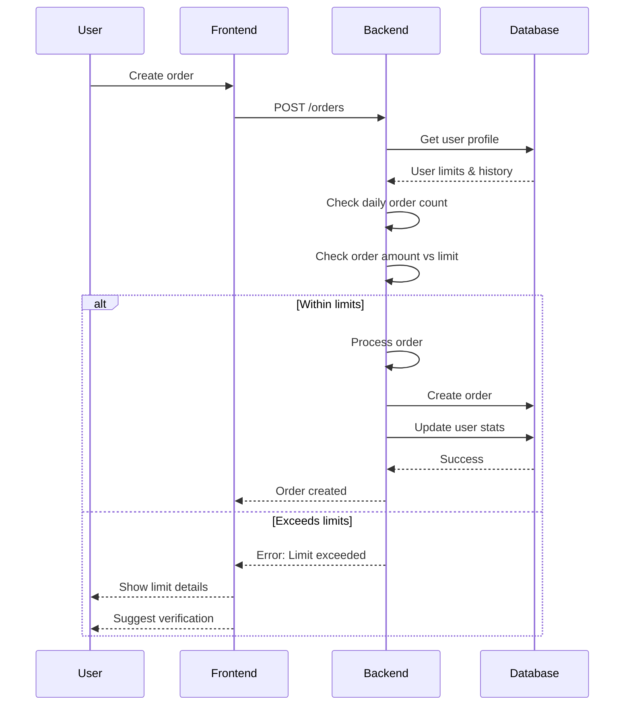

## Dispute Resolution Flow (Future)

Handle payment disputes.

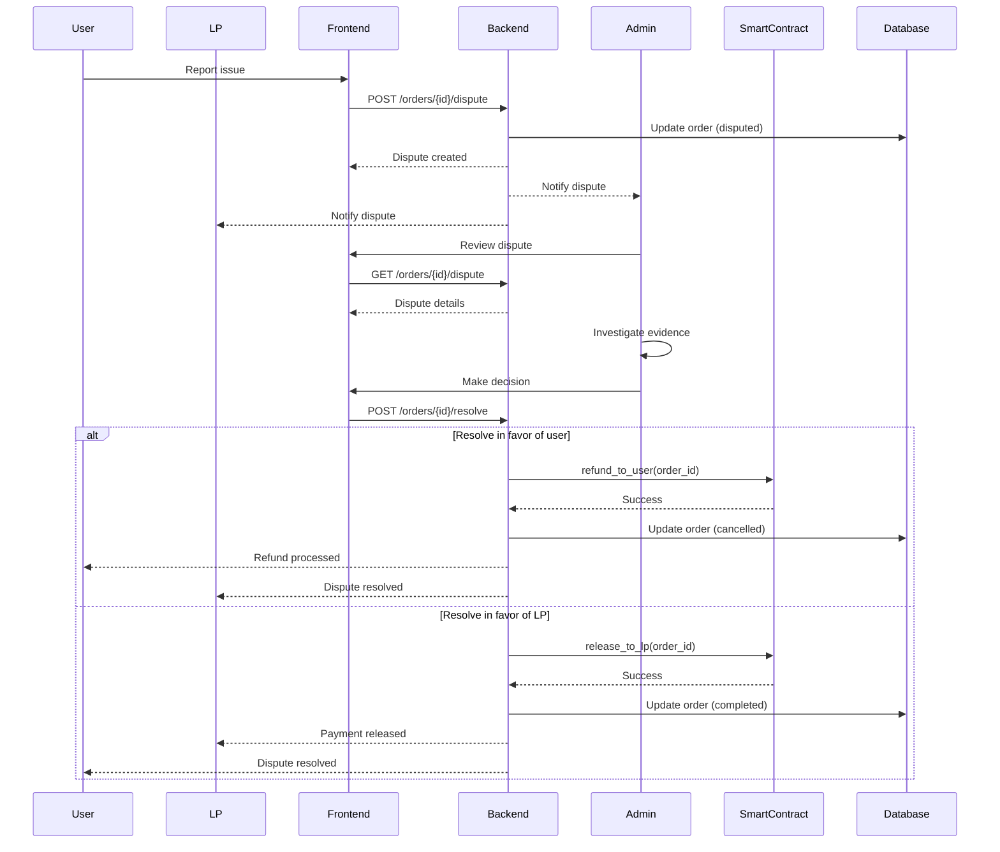

## Use Case Summary

### User Actions
- Connect wallet
- Create sell order
- Create buy order
- Confirm payment received
- Cancel order
- View order history

### LP Actions
- Register as LP
- View available orders
- Accept order
- Send PIX payment
- Confirm payment received
- Update availability
- View earnings

### System Actions
- Validate user limits
- Calculate fees
- Generate PIX QR codes
- Update exchange rates
- Process order completion
- Distribute fees
- Handle disputes

### Smart Contract Actions
- Lock DOT in escrow
- Accept order
- Release DOT to LP
- Cancel and refund
- Distribute fees

